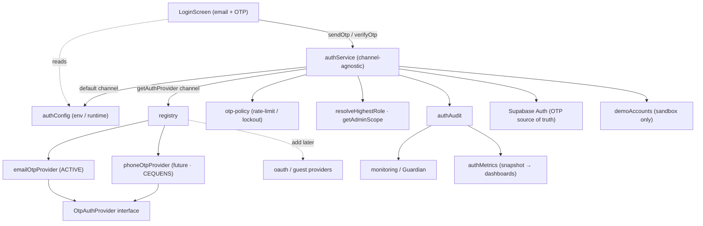
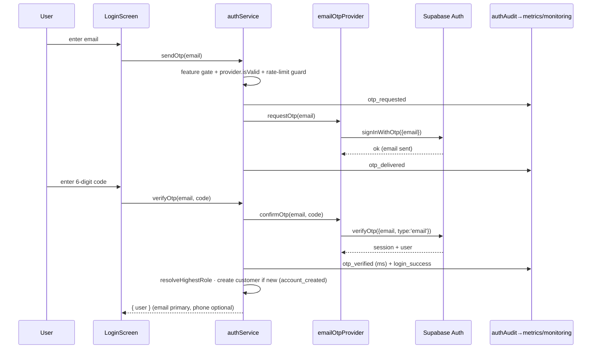

# Authentication Platform — Architecture Report

Provider-based, channel-agnostic authentication. Email OTP is the active production
channel (Egypt-first closed beta); Phone (CEQUENS) and OAuth/guest are future channels
that slot in with **no auth refactor**. This document reflects the hardened design
(configurable channel, feature flags, audit log, metrics, true DI).

## Component diagram

## Sequence diagram — email OTP login

## Provider flow
Every channel implements one interface (`OtpAuthProvider`): `normalize`, `isValid`,
`requestOtp`, `confirmOtp`, `sandboxAccount`, `resolveIdentity`, `mask`. `authService`
calls only these — it contains **zero channel-specific branches**. The active channel and
which channels/methods are enabled come from **`authConfig`** (env `VITE_AUTH_CHANNEL` /
`VITE_AUTH_FLAGS`, or `configureAuth()` at runtime), never hardcoded.

| Concern | Owner |
|---|---|
| Normalize / validate identity, send / verify OTP, sandbox lookup, mask | **provider** |
| Active channel + feature flags | **authConfig** (env/runtime) |
| Rate-limit / lockout / replay guard | **otp-policy** (channel-agnostic) |
| RBAC role + admin scope, customer creation, session, logout | **authService** |
| Audit events + metrics | **authAudit → authMetrics + monitoring** |

## Extension guide (add a channel — no auth refactor)
1. Implement `OtpAuthProvider` (e.g. `googleOAuthProvider`) in `src/services/auth/`.
2. Register it in `registry.ts` `AUTH_PROVIDERS`.
3. Add its feature key to `AuthFeature` + `DEFAULT_FEATURES` in `config.ts`.
4. Activate via env — `VITE_AUTH_CHANNEL=phone` or `VITE_AUTH_FLAGS=email_otp,google_oauth` — **no code change to switch**. The LoginScreen already renders entry points by flag.
Phone/CEQUENS is already implemented (`phoneOtpProvider`) — activation is `VITE_AUTH_CHANNEL=phone` + `phone_otp` in flags.

## Configuration reference
| Var | Values | Default | Effect |
|---|---|---|---|
| `VITE_AUTH_CHANNEL` | `email` \| `phone` | `email` | Active OTP login channel |
| `VITE_AUTH_FLAGS` | comma list of `email_otp,phone_otp,google_oauth,apple_oauth,facebook_oauth,guest` | (unset → defaults) | Enabled methods; explicit list is authoritative |

## Audit events (→ Guardian/monitoring + metrics)
`otp_requested`, `otp_delivered`, `otp_verified`, `login_success`, `login_failure`,
`account_created`, `account_locked`, `rate_limit_triggered`, `resend_requested`, `logout`.
Identities are masked before recording (no PII).

## Metrics (`authService.getMetrics()` → dashboards)
Counters (all events above) + rates: `loginSuccessRate`, `loginFailureRate`,
`otpVerificationRate`, `otpDeliveryFailureRate`; `averageVerificationMs`,
`resendRequests`, `lockedAccounts`.

## Security review
- **Server-authoritative OTP** — generated/sent/verified/expired by Supabase; the client never sees, stores, or generates a code. Current APIs only (`verifyOtp type:'email'`), no deprecated calls.
- **Rate-limit + brute-force** guard (cooldown, per-window cap, invalid-attempt lockout, replay consumption); every denial is audited (`rate_limit_triggered` / `account_locked`).
- **Defense-in-depth feature gate** — a disabled channel is refused server-side (`channel_disabled`), not only hidden in the UI.
- **No PII in telemetry** — identities masked (`mask()`), payloads minimal.
- **RBAC unchanged** — `resolveHighestRole` + `getAdminScope` (super/country) preserved; covered by tests.
- **True DI** — `authService` depends only on the provider interface + config; no channel-specific logic (the previous email-specific error string was made generic).
- **Sandbox isolation** — demo roster gated by `IS_SANDBOX`; demo-isolation lint green.

## Remaining risks
| Risk | Severity | Mitigation / status |
|---|---|---|
| Metrics/audit are **in-process** (per instance, non-persistent) | Medium | Fine for a single-instance beta + monitoring seam; for fleet-wide dashboards, ship events to a store (the `monitoring` seam already POSTs when a DSN is set). |
| Email deliverability / inbox placement (Egypt) | Medium | Provider decided (Resend, ADR-EMAIL-PROVIDER) + SPF/DKIM/DMARC plan; activation pending. |
| OAuth/guest are **entry-point placeholders** (not implemented) | Low | Flags gate visibility; providers must be implemented before enabling functionally. |
| `resend_requested` only counts sends that pass the cooldown | Low | By design (a blocked resend is a `rate_limit_triggered`); documented. |
| Client-side guard is defense-in-depth, not the boundary | Low (by design) | Supabase enforces server-side rate limits; the client guard can only be stricter. |

## Test coverage
16 auth tests (providers, email OTP send/verify, invalid/unknown/rate-limit/lockout,
RBAC scope, config/flags switch, feature gate, audit→metrics). Full suite: 769 pass ·
tsc/lint/build green · Guardian 531 files / 0 cycles / 0 violations.
