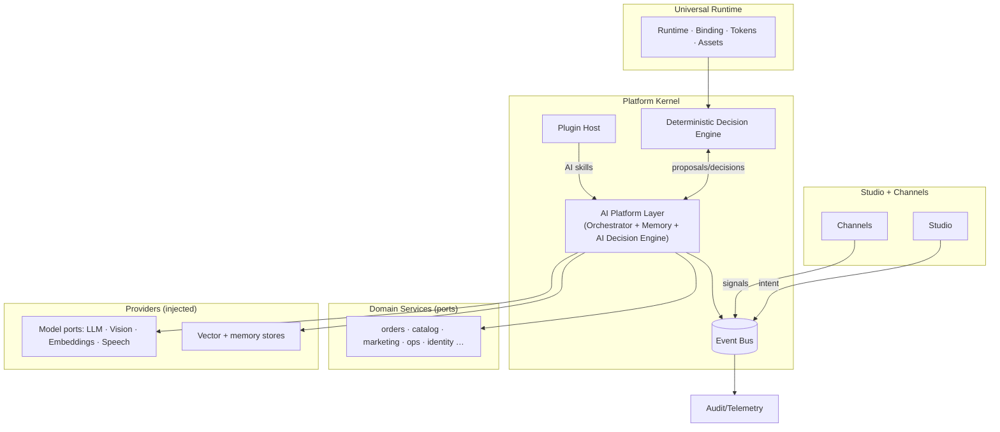
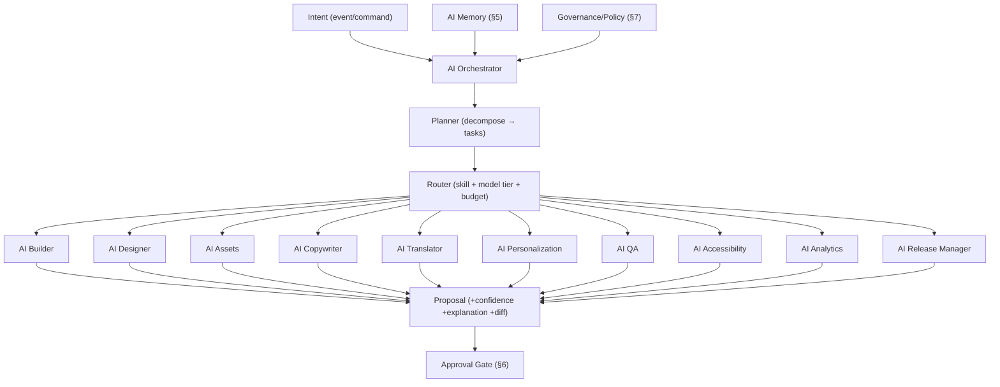
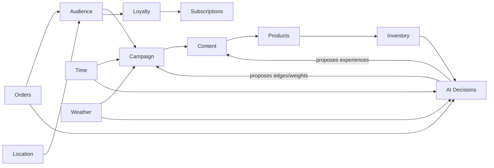
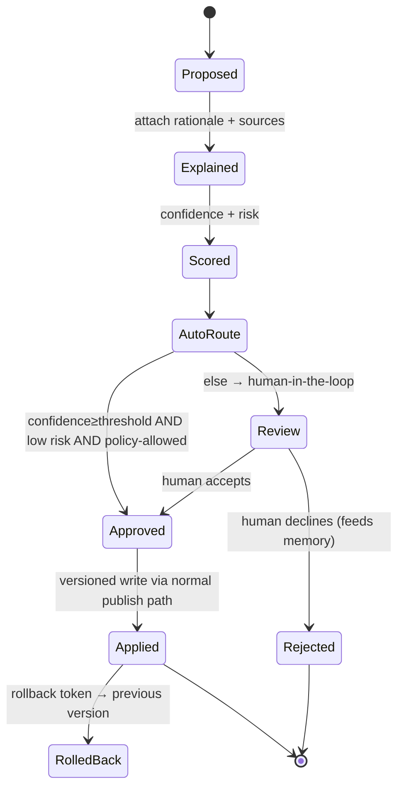
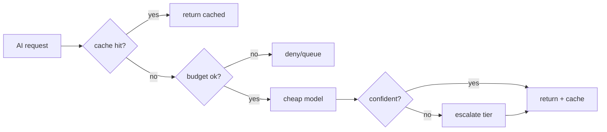
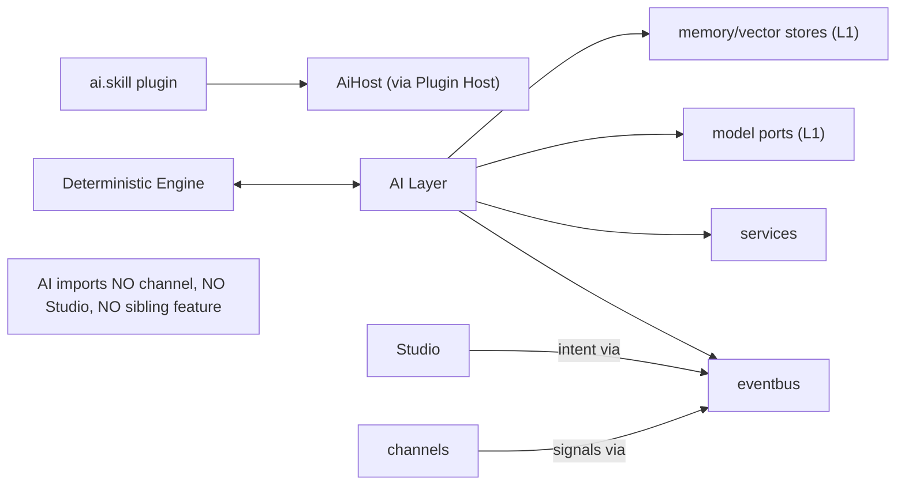

# HAAT NOW — Master AI Platform Architecture (Blueprint)

**Status:** Final AI design. **Architecture only — no implementation, no refactor, no code generation.** Extends `MASTER_PLATFORM_ARCHITECTURE.md` and `STUDIO_RUNTIME_ARCHITECTURE.md`.

**Thesis:** AI is **not** a feature, plugin, or Studio panel. AI is a **Core Platform Layer** — a peer of the Kernel that every runtime, channel, and Studio consumes through ports and the event bus, never by direct coupling.

**Grounding & honesty:** today HAAT NOW ships a **deterministic** decision/personalization engine (`src/experience-engine/`, `experience-platform.service`) with **no ML and no model provider wired**. This document defines the AI layer as the seam that makes model providers a drop-in. Consistent with the standing platform rules: **no external provider is assumed present**, **no secrets on the client** (AI runs server-side; CSP blocks client model calls), and **AI never auto-applies to production** — Guardian and human approval remain authoritative.

---

## 0. AI-native principles (invariants)

1. **AI proposes; the deterministic engine + humans dispose.** Every AI output is a *proposal* with confidence + explanation, gated by approval. Nothing AI produces reaches production unreviewed.
2. **Ports, not vendors.** LLM / vision / embedding / speech providers are L1 adapters injected by env. The core assumes none; absent provider ⇒ AI capability *absent*, never faked.
3. **Server-side only.** Model calls, keys, and memory live behind Edge Functions / workers. The client sends intents and renders results.
4. **Governed by construction.** Policy, budget, redaction, audit, and kill-switch are enforced in the orchestrator, not per-caller.
5. **Deterministic fallback always exists.** Remove the AI layer and the platform still runs on the existing rules engine.

---

## 1. Position in the global architecture (Part 1)

The AI Platform Layer sits at **L3 (Kernel)**, a peer of the Decision Engine, Event Bus, and Plugin Host. It talks to the platform **only** through the Event Bus and Service ports — it imports no channel, no Studio, no feature.



**Responsibilities of the AI layer:** orchestrate AI work (Part 2), host installable AI skills (Part 3), read/write the Experience Graph (Part 4), maintain layered memory (Part 5), and produce **explainable, confidence-scored, approvable, reversible** decisions (Part 6) — all under governance, security, and cost controls (Part 7).

---

## 2. AI Orchestrator (Part 2)

The central intelligence. It receives an **intent** (from Studio, a channel, a schedule, or an event), plans it into **tasks**, routes each to a **worker**, supplies **memory context**, enforces **governance + budget**, and returns **proposals** to the Decision Engine / approval gate.



| Worker | Produces | Consumes / grounds on |
|---|---|---|
| **AI Builder** | page/section/component drafts (metadata trees) | Studio metadata hierarchy (§4 of platform doc) |
| **AI Designer** | token/layout proposals | Design Tokens Engine |
| **AI Assets** | asset transforms/variants (proposals) | Universal Asset Engine (worker-side) |
| **AI Copywriter** | copy per surface/brand voice | Brand Memory + content store |
| **AI Translator** | localized strings (AR/EN/…) | i18n + glossary memory |
| **AI Personalization** | audience/experience proposals | Experience Graph (§4) + deterministic engine |
| **AI QA** | test/lint/edge-case findings | build + metadata + journeys |
| **AI Accessibility** | a11y fixes (contrast, labels, reduced-motion) | tokens + axe rules |
| **AI Analytics** | insights, anomalies, forecasts | event bus telemetry |
| **AI Release Manager** | release notes, risk score, rollout plan | Visual Diff + Guardian (never auto-applies) |

Workers are **stateless**; all context comes from Memory; all outputs are **proposals**, never direct writes.

---

## 3. AI Skills SDK (Part 3)

Every AI capability — including verticals — is an **installable Skill** on the existing Plugin SDK (`capability: 'ai.skill'`). Restaurant / Beauty / Pharmacy / Logistics / CRM / ERP / SEO / Marketing AI are packs, not core code.

```
AiSkill extends Plugin {
  capability: 'ai.skill'
  domain: 'restaurant'|'beauty'|'pharmacy'|'logistics'|'crm'|'erp'|'seo'|'marketing'|…
  tools: ToolSpec[]          // typed functions the orchestrator may call (sandboxed)
  prompts: PromptPack        // versioned, evaluated (§7)
  knowledge?: KnowledgeRef[] // domain corpora → embeddings (tenant-scoped)
  guardrails: Guardrail[]    // domain policy (e.g. pharmacy dosage safety)
  register(host: AiHost): void
}
AiHost { orchestrator; memory(scope); events; models(port); tokens; storage(scoped) }
```

- A skill **contributes tools + prompts + knowledge**; it never calls a model or the platform directly — the orchestrator brokers everything, so budget/policy/audit apply uniformly.
- Skills are **sandboxed** (scoped memory, declared permissions, capability-gated tools) exactly like plugins (§6–§7 of the platform doc).
- Domain guardrails (e.g. pharmacy safety, dietary/halal constraints) are declared and enforced before any proposal leaves the skill.

---

## 4. Experience Graph (Part 4)

Replace isolated if/then rules with a **typed relationship graph**. Nodes are entities; edges are relationships with weights/conditions. The deterministic engine traverses it; AI **proposes** new nodes/edges/weights (as reviewable diffs).



- **Nodes:** Audience, Campaign, Content, Inventory, Location, Time, Weather, Orders, Loyalty, Subscriptions, Products, **AI Decisions**.
- **Edges** carry conditions, weights, validity windows, and provenance (rule vs AI-proposed).
- The graph is **versioned and diffable**; a Studio user reviews AI-proposed edges before they influence live decisions. Today's flat flag/targeting registry (`experience-channels`, `PLATFORM_FLAGS`) is the seed — the graph generalizes it.

---

## 5. AI Memory (Part 5)

Layered, scoped, permissioned persistent context. Each layer has its own store, TTL, and redaction policy; retrieval is least-privilege.

```mermaid
graph TD
  PLATM[Platform Memory\n(global patterns, evals)] --> ORCH[Orchestrator retrieval]
  TENM[Tenant Memory\n(config, history)] --> ORCH
  BRANDM[Brand Memory\n(voice, tokens, do/don't)] --> ORCH
  USERM[User Memory\n(prefs — consented, redactable)] --> ORCH
  CAMPM[Campaign Memory\n(goals, results)] --> ORCH
  STUM[Studio Memory\n(edit history, intents)] --> ORCH
  SESSM[Session Memory\n(short-lived working context)] --> ORCH
```

| Layer | Scope | Store | Policy |
|---|---|---|---|
| Platform | global | vector + metrics | anonymized, eval-only |
| Tenant | per tenant | structured + vector | isolated, residency-aware |
| Brand | per brand pack | structured | versioned with the pack |
| User | per user | structured | **consent-gated, PII-redacted, right-to-erasure** |
| Campaign | per campaign | structured + vector | archived on close |
| Studio | per author/project | structured | edit provenance |
| Session | ephemeral | in-memory | TTL, never persisted raw |

- **Isolation is hard**: no cross-tenant retrieval; embeddings are namespaced per tenant.
- **Provenance + redaction** on write; retrieval respects RBAC and data class.

---

## 6. AI Decision Engine (Part 6)

Turns proposals into governed decisions. Five guarantees on every AI output:



- **Explainability:** every decision carries *why* (rationale + the graph/memory/sources it used).
- **Confidence + risk:** numeric score + risk class; thresholds are policy (per tenant/action/data-class).
- **Approval + Human-in-the-loop:** low-confidence/high-risk always routes to a human; **production-affecting AI is never auto-applied** (Guardian rule).
- **Rollback:** decisions are versioned and reversible through the existing publish/rollback path; a rejection updates memory so the system learns.

---

## 7. Governance, Security, Cost (Part 7)

**AI Governance**
- **Model Registry + Policy:** allowed models per tenant/region/data-class; capability→model routing; deprecation/migration.
- **Guardrails & Eval:** prompt-injection defense, output validators, domain guardrails, offline eval suites gating prompt-pack releases.
- **Audit:** every AI action is an event (`ai.proposed@1`, `ai.approved@1`, `ai.applied@1`) → immutable audit + telemetry.
- **Kill switch:** per-skill / per-capability / global disable; deterministic fallback resumes instantly.

**Security**
- Keys and model calls **server-side only**; nothing on the client (CSP-enforced).
- Skills sandboxed: scoped memory, least-privilege tools, capability-gated.
- Tenant isolation of memory + embeddings; PII redaction + consent + erasure; data residency honored.
- Prompt-injection & tool-abuse defenses at the orchestrator boundary.

**Cost optimization**
- **Model tiering:** cheap model first, escalate only on low confidence.
- **Caching:** prompt cache, embedding cache, result cache keyed by `(inputs, model, version)`.
- **Batching + async:** non-interactive work on queues/workers; interactive work streamed.
- **Budgets + accounting:** per-tenant/skill/task token budgets; spend metered via the event bus; hard ceilings.



---

## 8. Lifecycles & dependency graph

**AI request lifecycle:** intent → plan → route(skill+tier+budget) → retrieve memory → run worker → propose(+explain+score) → approval/HITL → apply via publish path → emit events → (rollback token retained).

**Dependency graph (allowed edges):**

The AI layer sits behind the event bus + ports; it never imports channels/Studio/features → the acyclic invariant (§2 of the platform doc) holds, Guardian-enforced.

**10-year scalability — permanent vs evolving**
- **Permanent:** AI as an L3 core layer behind ports + event bus; proposal→approval→apply→rollback contract; layered memory model; Experience Graph; governance/security/cost controls.
- **Evolves without redesign:** new **models** (a port impl), new **AI skills/verticals** (a plugin), new **memory stores** (a store adapter), new **channels** consuming AI (register + adapter). Swapping a model vendor or adding Pharmacy AI touches **zero** core code.

---

## 9. Boundaries of this document (honest)

- **No code, no refactor.** Blueprint only.
- **Today:** the shipped engine is **deterministic** (rules/flags/personalization, no ML); **no model provider is wired**; AI here is the seam that makes one a drop-in.
- **Ports awaiting providers:** LLM, vision, embeddings, speech, vector store — each absent until configured; **absent ⇒ the AI capability is absent, never faked** (same rule as COD-only payments).
- **Non-negotiable:** production-affecting AI is **never auto-applied**; explainability, approval, human-in-the-loop, and rollback gate every decision; keys and inference stay server-side.
- "Nothing requires redesign later" is a guarantee about **shape** (the layer, contracts, and seams), not a promise that no code is written — you grow by adding models, skills, memory stores, and channels.
