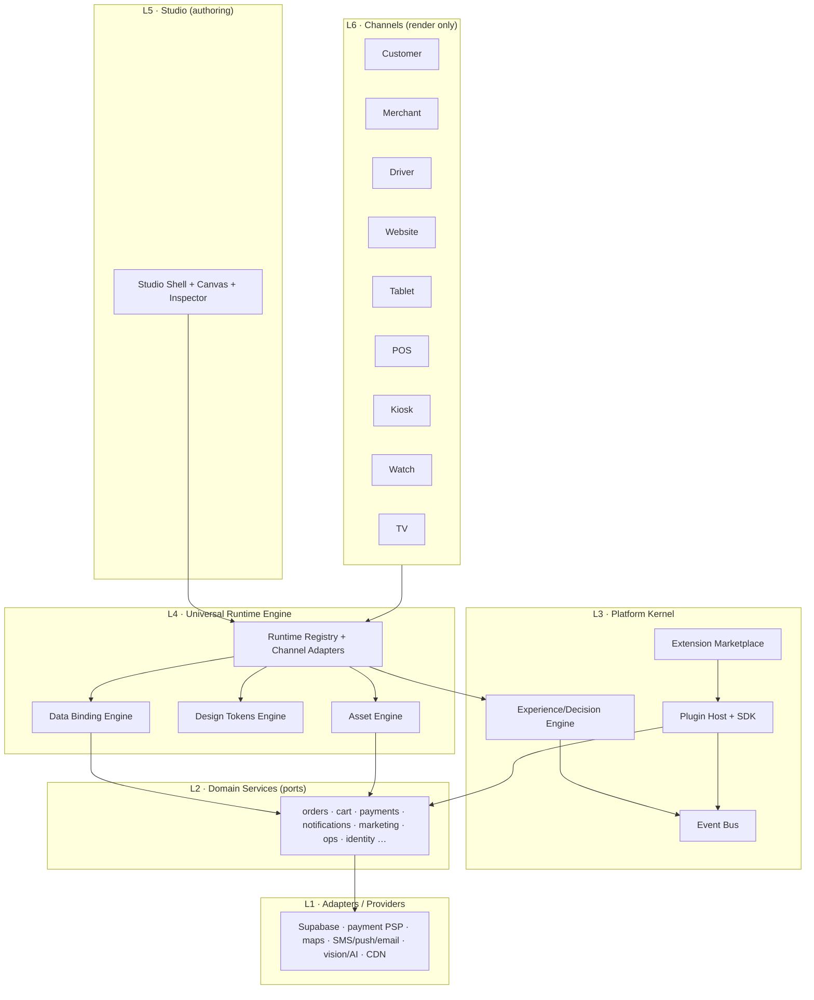
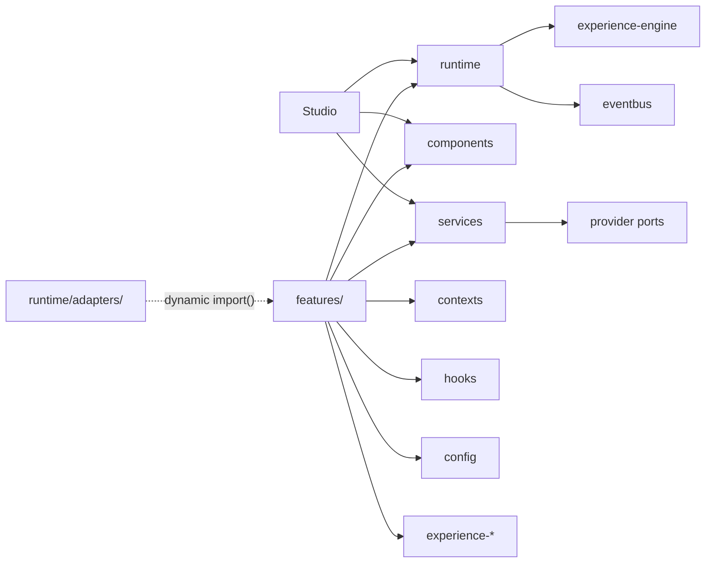
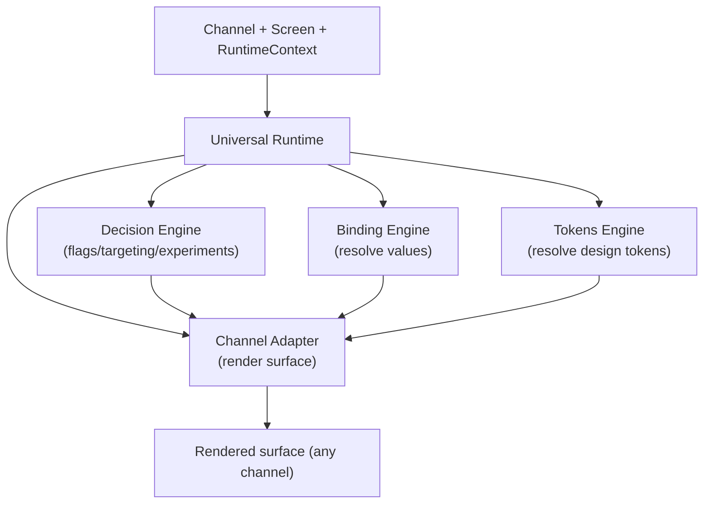
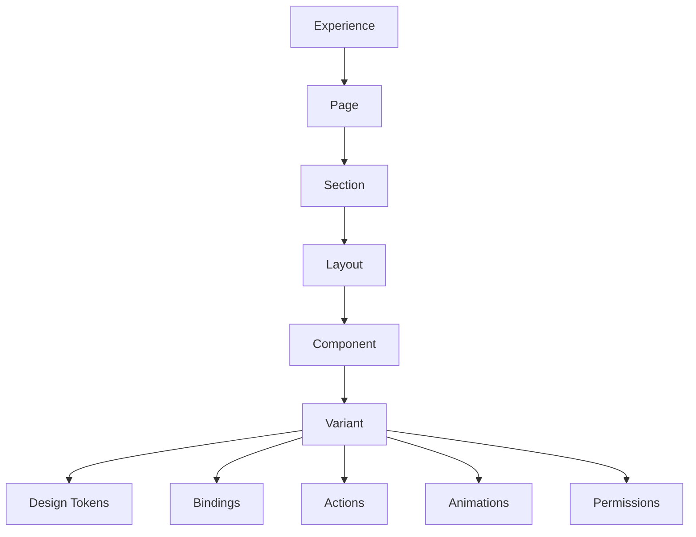
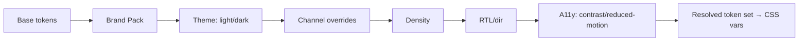
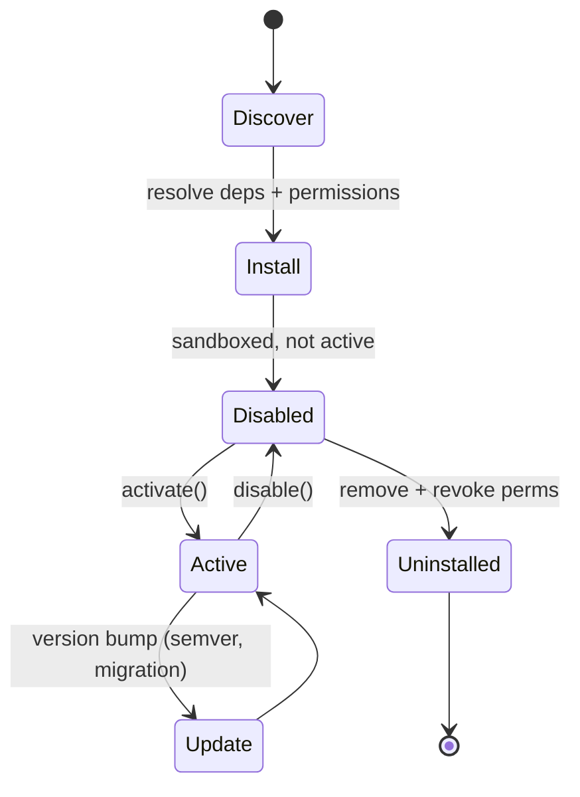
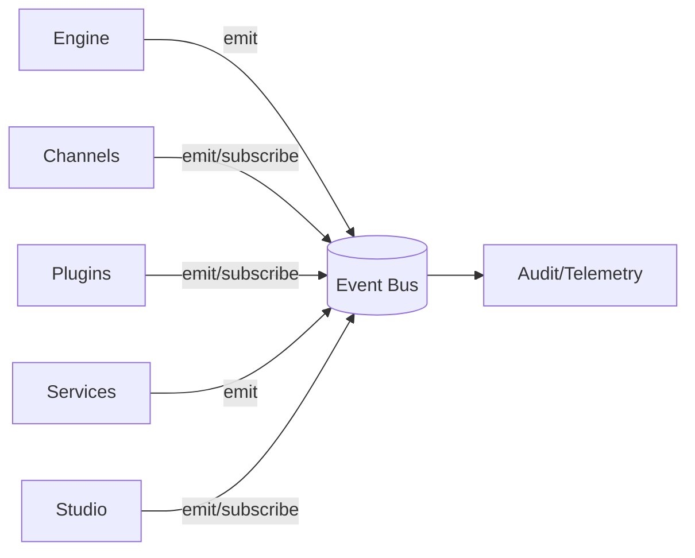
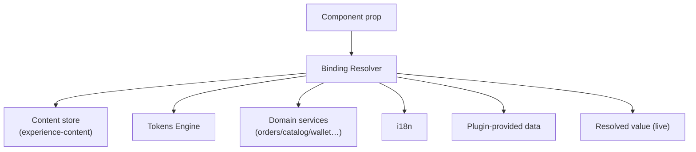
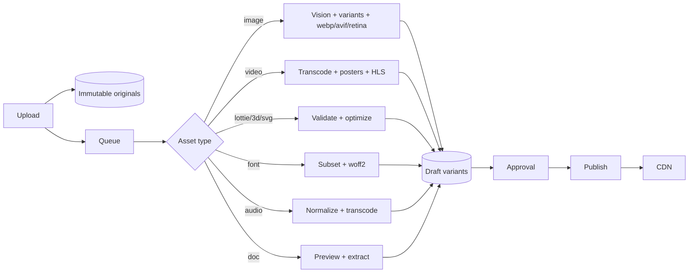

# HAAT NOW — Master Platform Architecture (Blueprint)

**Status:** Final platform design. **No implementation, no refactor** — this document defines the permanent architecture that the migration (`STUDIO_RUNTIME_ARCHITECTURE.md` M1–M8) and all future features build on.

**Thesis:** HAAT NOW is **not** a Customer app + Merchant app + Driver app + Website. It is **one Universal Platform**. Customer, Merchant, Driver, Website, Tablet, POS, Kiosk, Watch, TV, and everything after them are **Channels** — presentation targets of the same runtime, engine, content, tokens, and data.

Grounded in what already exists: `src/runtime/` (the adapter seam, landed), `src/experience-engine/` (pure decision engine), `src/experience-channels/` (channel registry), `src/experience-content/` (content source of truth), `src/services/*` (domain services), `src/config/runtime.ts` (sandbox/live, COD-only).

---

## 0. Principles (the invariants that never change)

1. **One runtime, many channels.** Logic lives once; channels only render.
2. **Ports & adapters everywhere.** The core imports interfaces; concretes are injected. No core code assumes a provider exists.
3. **Declared, not reflected.** The Studio edits **metadata**, never React internals.
4. **Acyclic by construction.** A feature/channel never imports a sibling; everything meets at neutral seams (`runtime/`, `services/`, `components/`, the event bus). Guardian enforces it.
5. **Everything tokenized, everything bindable, everything eventful.**
6. **Honest capability gating.** A capability that has no provider configured is *absent*, never faked (`COD-only` today because no payment provider is wired).

---

## 1. The canonical stack (layer diagram)



**Reading rule:** dependencies point **down** only. L6 channels and L5 Studio both sit on the **same** L4 runtime — that is what makes the Studio able to edit every channel. Nothing in L1–L4 knows a channel exists.

---

## 2. Dependency graph & the enforced boundary

Allowed import edges (everything else is a Guardian violation):



- A channel **never** imports another channel. The Studio **never** imports a channel implementation — only `runtime/registry`.
- Channel implementations are reachable **only** through `runtime/adapters/*`, and only via **dynamic `import()`** → no static edge → cycles are structurally impossible.
- **Enforcement:** `scripts/check-architecture.cjs` gains the rule "`features/<A>` must not import `features/<B>`" (migration step M2). Guardian's `0 cycles` becomes an *enforced invariant*, not a snapshot.

---

## 3. Universal Runtime Engine (Parts 1–2)

**One runtime. Multiple Channel Adapters. Zero duplicated logic.**

The runtime is the composition of four cooperating engines behind the registry seam already landed in `src/runtime/`:

| Engine | Responsibility | Seed in repo |
|---|---|---|
| **Channel Adapters** | Turn a channel id + screen id + context into a rendered surface | `runtime/RuntimeAdapter.ts`, `registry.ts` (landed) |
| **Decision Engine** | Personalization, flags, targeting, experiments — *what* to show | `src/experience-engine/`, `experience-platform.service` |
| **Data Binding Engine** | Resolve every value from content/theme/data/i18n (Part 8) | new `runtime/binding/` |
| **Tokens Engine** | Resolve design tokens per brand/theme/channel/density (Part 4) | `tenantService` brand tokens → generalized |



**Channel model** — every channel is data + an adapter, never a bespoke app:

```
Channel {
  id: 'customer'|'merchant'|'driver'|'website'|'tablet'|'pos'|'kiosk'|'watch'|'tv'|…
  form: 'mobile'|'tablet'|'desktop'|'pos'|'kiosk'|'watch'|'tv'
  status: 'active'|'planned'
  adapter: RuntimeAdapter        // lazy screens + metadata + tokens
  capabilities: CapabilityId[]   // which plugins this channel can use
}
```
The existing `experience-channels/channels.ts` registry (customer/merchant/driver/website + planned email/push/sms/whatsapp/kiosk/voice/tv) is the seed; POS/Watch/TV/Tablet slot in as new channel rows + adapters — **no new runtime**.

---

## 4. Design System Metadata (Part 3)

The Studio edits a **declared hierarchy**, not React. Each level is addressable, versioned, and bindable. Extends `runtime/StudioMetadata.ts`.



| Level | Owns | Notes |
|---|---|---|
| **Experience** | targeting, flags, experiments, audience | the Decision Engine's unit |
| **Page** | route, SEO, channel visibility | one per channel screen |
| **Section** | ordering, lock/hide, targeting | today's `WebsiteBlock` / channel surface |
| **Layout** | grid/stack/flow, responsive rules, density | tokenized |
| **Component** | the editable atom (`StudioComponentMetadata`) | declared metadata |
| **Variant** | A/B arm, theme variant, state (empty/loading/…) | drives State Preview |
| **Design Tokens** | resolved styling (Part 4) | never hardcoded |
| **Bindings** | value sources (Part 8) | content/theme/data/i18n |
| **Actions** | events emitted (Part 7) | no direct calls |
| **Animations** | named motion tokens | from Tokens Engine |
| **Permissions** | who can see/edit/publish | RBAC-scoped |

Every node carries a stable `id` (survives refactors) and a `version`. The Studio inspector is a pure function of this tree.

---

## 5. Design Tokens Engine (Part 4)

One resolver, layered override, channel- and density-aware. Everything visual is a token; components reference tokens, never literals.



Token families: **typography, spacing, radius, elevation/shadow, motion/animation, color, dark, RTL, accessibility, density, brand packs.**

- Resolution order (later overrides earlier): base → brand pack → theme(light/dark) → channel → density → dir(RTL) → a11y(prefers-contrast/reduced-motion).
- Output is a flat CSS-custom-property set applied per surface (today's `themeVars` generalized; the App Studio Theme editor already writes brand tokens live).
- **Brand Packs** are first-class, versioned bundles (a tenant/white-label brand = one pack). Switching packs re-skins every channel with zero code.
- A11y and RTL are **tokens, not branches** — no forked layouts.

---

## 6. Plugin SDK (Part 5)

Every future capability is a **plugin** implementing a typed contract; the kernel ships no vendor. Payments, Maps, AI, ERP, CRM, Analytics, Loyalty, Messaging, Marketing, POS — all plugins.

```
Plugin {
  id; version; capability: 'payments'|'maps'|'ai'|'erp'|'crm'|'analytics'|'loyalty'|'messaging'|'marketing'|'pos'|…
  permissions: Permission[]        // declared, granted at install
  dependencies: PluginRef[]        // resolved by the marketplace
  register(host: PluginHost): void // subscribe to events, expose services/UI slots
  activate(ctx): void; deactivate(): void
}
PluginHost {
  events: EventBus                 // the ONLY way plugins talk to the platform
  services: ServiceRegistry        // request a port (e.g. PaymentPort) — never a concrete
  slots: UiSlotRegistry            // contribute Studio panels / channel surfaces
  storage: ScopedStore             // sandboxed, per-plugin
  tokens: TokenRegistry            // read/extend design tokens
}
```

- Plugins **communicate only through the Event Bus and Service ports** — never import platform internals or each other directly.
- A capability with **no active plugin** is *absent* (the COD-only rule generalized: no payment plugin ⇒ no card payments, never a fake success).
- Plugins run **sandboxed**: scoped storage, declared permissions, capability-gated event access.

---

## 7. Extension Marketplace (Part 6)

Lifecycle for third-party and first-party plugins.



Guarantees: **semver** versioning + upgrade migrations; **dependency resolution** (a plugin declares required capabilities/plugins); **permission grants** at install (revoked on uninstall); **sandbox** isolation; **disable ≠ uninstall** (state preserved). The existing Platform Registry / Integrations admin surfaces are the seed UI.

---

## 8. Event Bus (Part 7)

The platform's spinal cord. Everything communicates through **typed events**; no module calls another module directly across a boundary.



- Events are **versioned schemas** (`order.placed@1`, `experience.published@1`, `asset.approved@1`).
- Delivery: in-process synchronous for UI, async (queue) for workers/plugins.
- The bus is the audit + telemetry tap (every event is observable) and the seam that keeps plugins decoupled.

---

## 9. Universal Data Binding Engine (Part 8)

Every editable value is a **binding**, resolved uniformly regardless of channel.

```
Binding { source: 'content'|'theme'|'data'|'i18n'|'static'|'plugin'; path; transform?; readonly? }
```



- One resolver, five+ sources; the Studio inspector shows the binding, not the literal.
- Live: a content/token edit re-resolves and re-renders immediately (already true for experience content + theme in the App Studio).
- Writes route back to the owning source (content edits persist to the content store; data bindings are read-only in the Studio).

---

## 10. Universal Asset Engine (Part 9)

One pipeline for **images, video, icons, fonts, audio, Lottie, 3D, SVG, documents, AI assets** — async, provider-agnostic, approval-gated, non-destructive (full design in `STUDIO_RUNTIME_ARCHITECTURE.md §4`).



- Type detected on upload; each type routes to its worker; all produce **draft** derivatives requiring **approval** before publish.
- **AI transforms** (bg-removal, outpaint, upscale, vision) are worker-side ports — **absent unless a provider is configured**, never faked client-side. Client-only honest step: canvas responsive/webp variants for jpg/png/webp.
- Originals immutable; derivatives keyed by `(originalId, transformHash)`; publish promotes draft→live→CDN with cache invalidation.

---

## 11. Lifecycles (Part 10)

**Runtime lifecycle** (per surface):
```
resolve channel+screen → build RuntimeContext → Decision(flags/experiments)
  → resolve Bindings → resolve Tokens → adapter.load() (lazy) → render → emit view events
```

**Studio lifecycle** (authoring):
```
open channel → registry.getRuntime(id) → load screen metadata tree
  → select node → inspector(bindings/tokens/props) → edit → live re-resolve
  → history(undo/redo) → Publish
```

**Publish lifecycle**:
```
draft → validate(schema+permissions) → Visual Diff(semantic/pixel/a11y/CI-metrics)
  → approval gate → version bump → promote(draft→live) → emit published@v → CDN invalidate → rollback token retained
```

**Plugin lifecycle**: Discover → Install(deps+perms) → Disabled → Active → Update(semver+migration) → Disabled → Uninstalled (§7).

---

## 12. Scalability & the 10-year view

**What is permanent (should never need redesign):** the layer stack (§1), the acyclic dependency rule (§2), the runtime seam (`runtime/`), the ports-&-adapters contract, the metadata hierarchy (§4), the token resolution model (§5), the event bus as the only cross-boundary channel (§8), the binding model (§9).

**What is expected to grow (without touching the core):**
- **New channels** (POS, Watch, TV, AR…) = a channel row + an adapter. Zero runtime change.
- **New capabilities** = a plugin. Zero kernel change.
- **New providers** (a real PSP, a vision model, a maps vendor) = a port implementation, injected by env. Zero domain change.
- **New brands/tenants** = a Brand Pack. Zero code.
- **Scale-out**: async work (assets, plugins, diff, notifications) runs on queues + workers; the client stays thin; the runtime is stateless per surface.

**Honest limits (design, not fabrication):** several capabilities are *ports awaiting providers* — payments (COD-only until a PSP plugin lands), AI/vision (worker + provider required), SMS/push/email (transports required), live infra (prod currently points at the dev DB per the launch audit). The architecture makes each a drop-in, but none is faked as present.

---

## 13. Boundaries of this document

- **No code, no refactor.** This is the blueprint; the executable migration is `STUDIO_RUNTIME_ARCHITECTURE.md` (M0 landed: `runtime/` contracts; M1–M8 sequenced).
- "Nothing requires redesign after this point" is the **target** the seams are chosen to protect — evolution happens by adding channels, plugins, providers, and brand packs, not by rewriting the core. It is a design guarantee about *shape*, not a promise that no code is ever written.
