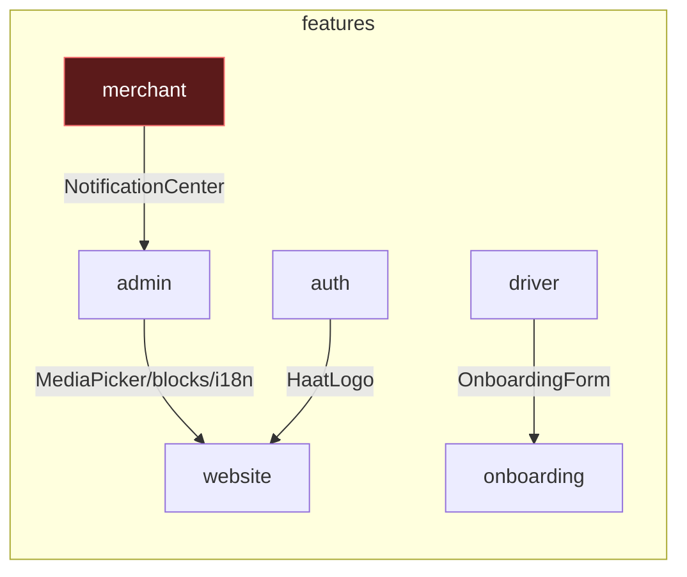
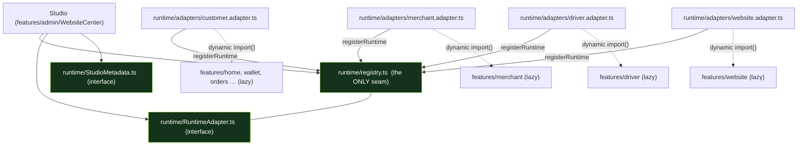
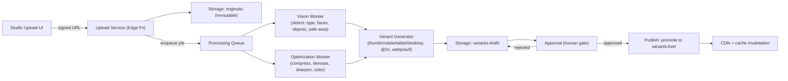
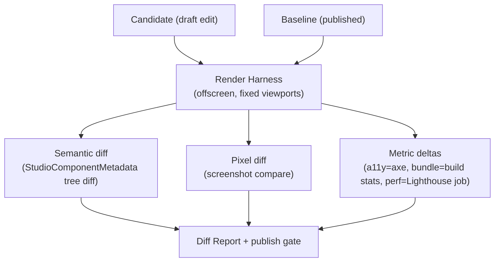

# Studio Runtime Architecture

**Status:** Design + contract layer landed. Migration sequenced below (not yet executed).
**Goal:** the Studio becomes the permanent, single editor for **all** applications — Customer, Merchant, Driver, Website, and future channels — with **zero import cycles**.

Everything here is grounded in the measured dependency graph, not speculation.

---

## 0. Measured current state (evidence)

Guardian snapshot: **463 files · 0 cycles · 0 violations**. So there are **no cycles today**. The blockers are *latent* couplings that would become cycles the moment the Studio imports an app implementation.

Cross-feature edges (measured via import grep):

| Edge | Site | Why it exists | Cycle risk |
|---|---|---|---|
| `merchant → admin` | `MerchantApp.tsx:33` → `admin/NotificationCenter` | NotificationCenter is shared by **admin + merchant** but lives in `admin/` | **CRITICAL** — Studio (in `admin/`) importing `MerchantApp` ⇒ `admin→merchant→admin` cycle |
| `admin → website` | `studioUI.tsx:3`, `WebsiteCenter.tsx:14,22` → `website/MediaPicker`, `blocks`, `i18n` | Studio reuses the website renderer/picker | One-directional (website imports no feature) — no cycle, but wrong seam |
| `auth → website` | `LoginScreen.tsx:8`, `AccountGateway.tsx:3` → `website/icons` (HaatLogo) | Shared brand asset in `website/` | One-directional — no cycle, wrong home |
| `driver → onboarding` | `DriverApp.tsx:28` → `onboarding/OnboardingForm` | Shared onboarding form in `onboarding/` | One-directional (onboarding imports no feature) — no cycle |



**The one edge that must die for the goal:** `merchant → admin`. Every other edge is one-directional and safe today; they are cleaned up for correctness, not to break a cycle.

---

## 1. Target architecture — the Runtime seam

The Studio must never statically import `features/<app>`. Instead:

- Each app exposes a **Runtime Adapter** (a thin module that lazy-loads its screens).
- The Studio consumes adapters **only** through the **Runtime Registry**.
- A **dynamic import inside the adapter** means there is **no static edge** from the Studio to any app → cycles are structurally impossible, not just currently absent.



Dashed edges are **dynamic imports** — not part of the static graph. The Studio's static graph terminates at `runtime/*`.

**Contract files landed this sprint (pure types, zero cycle risk, verified `tsc` + Guardian 0-cycles):**
- `src/runtime/StudioMetadata.ts` — the metadata every editable component declares (Part 2).
- `src/runtime/RuntimeAdapter.ts` — the one interface all runtimes implement, incl. `defineRuntime()` and the lazy `RuntimeScreen.load` factory (Part 3).
- `src/runtime/registry.ts` — `registerRuntime` / `getRuntime` / `listRuntimes` (the seam).

---

## 2. Studio Metadata (Part 2)

Studio reads **declared** metadata, never React internals (React 19 removed `_debugSource`; fibers cannot yield a source file, editable props, or bindings). Contract: `StudioComponentMetadata` in `runtime/StudioMetadata.ts`:

`id` · `displayName` · `editableProps[]` (key, type, binding, validation) · `bindings[]` (source: content|theme|data|i18n|static + path) · `events[]` · `themeTokens[]` · `animations[]` · `validation` · `children[]`.

The inspector renders from these declarations. A component becomes "editable in the Studio" by shipping a metadata object next to it (or inside its adapter screen's `metadata[]`) — no reflection, no guessing.

---

## 3. Runtime Adapter Layer (Part 3)

One interface, five implementations (four now + future). `RuntimeAdapter` in `runtime/RuntimeAdapter.ts`:

```
RuntimeAdapter { id, label, form, themeTokens, screens: RuntimeScreen[], getScreen(id) }
RuntimeScreen  { id, label, load: () => Promise<Component<{ctx}>>, metadata[], requires[] }
RuntimeContext { identity, locale, country, sandbox }
```

Adapters to author during migration (each ~50–100 lines, lazy-only):

| Adapter | Wraps (lazy) | Notes |
|---|---|---|
| `customer.adapter.ts` | `home/HomeScreen`, `wallet/WalletScreen`, `orders/OrdersList`, `profile/ProfileScreen`, `discover/DiscoverScreen` | Already proven mountable (Live App). Move the direct imports out of `AppRuntimePreview` into here. |
| `merchant.adapter.ts` | `merchant/MerchantApp` | Only cycle-safe **after** `merchant → admin` is removed (§6). |
| `driver.adapter.ts` | `driver/DriverApp` | Cycle-safe once shared bits are relocated. |
| `website.adapter.ts` | `website/blocks`, renderer | Replaces `admin → website` direct imports with an adapter boundary. |
| future (`email`, `push`, …) | — | Register a "planned" adapter with empty `screens`. |

`ctx.sandbox` enforces the existing rule: seeded preview identities mount only in sandbox, never production.

---

## 4. AI Asset Pipeline — architecture only (Part 4)

**Not implemented.** Fully asynchronous, server-side, provider-agnostic, approval-gated, non-destructive. The client only uploads and approves.



Key rules:
- **Asynchronous**: upload returns a `jobId`; workers process off the request path; UI polls/subscribes.
- **Idempotent + immutable originals**: originals never mutated; every derivative is a new object keyed by `(originalId, transformHash)`.
- **Never overwrite**: AI proposals (crop, bg-removal, outpaint, upscale) are written as **candidates**; publish requires explicit approval (Part 7 workflow).
- **Provider-agnostic**: `VisionWorker`/`UpscaleWorker` are interfaces; concrete providers (a hosted vision model, a server `sharp` pipeline) are injected — the app assumes none by default.
- **Format reality**: browser-native decode covers jpg/png/webp/gif; **HEIC/TIFF/PSD/AI decode + AI transforms are server-worker responsibilities**, never client. AVIF/webp encode happens in the Optimization Worker.
- **Honest client fallback available now** (separate, optional): canvas-based `thumbnail/mobile/tablet/desktop/@2x/webp` variants for jpg/png/webp — real browser APIs, no ML, no fabrication. This is the *only* asset step buildable client-side.

Interfaces to define (design): `UploadService`, `AssetStore`, `JobQueue`, `VisionWorker`, `OptimizationWorker`, `VariantGenerator`, `ApprovalService`, `PublishService`, `Cdn`. All are ports; adapters are chosen by env.

---

## 5. Visual Diff Engine — architecture only (Part 5)

**Not implemented. No fake metrics.** Three independent layers, each producing a real, computable signal or explicitly "not available":



- **Semantic layer** (buildable honestly, client): diff the two metadata trees → "changed components" list. Deterministic, no rendering needed.
- **Pixel layer**: render baseline vs candidate in an isolated harness (iframe/offscreen) at declared viewports → image compare (e.g. pixelmatch). Real.
- **Metric layer**: a11y via `axe-core` (real, client); **bundle-size** and **runtime performance** are **build/CI signals**, computed by a server/CI job from real build stats and a Lighthouse run — surfaced in the report, **never invented in the browser**. If the CI signal is absent, the report shows "not available," not a number.
- Publish gate: block on regressions above thresholds (a11y violations, pixel-delta on locked regions, bundle budget).

---

## 6. Remaining blockers + enforcement (Part 6)

**Blockers to remove (in order of impact):**

1. **`merchant → admin`** — relocate `NotificationCenter`. This is the only true cycle-maker.
2. **Studio imports app screens directly** — `AppRuntimePreview.tsx` imports `home/`, `wallet/`, etc. Move these into `customer.adapter.ts`; Studio consumes the registry.
3. **`admin → website`** — route website rendering through `website.adapter.ts` (or relocate the shared renderer to `components/`).
4. **`auth → website` / `driver → onboarding`** — shared assets (`HaatLogo`, `OnboardingForm`) belong in `components/`, not a sibling feature.
5. **No boundary enforcement** — nothing prevents the next feature→feature import.

**Enforcement (the permanent guardrail):** add a rule to `scripts/check-architecture.cjs` (already runs in `lint`/CI):
> A file under `src/features/<A>/` may import from `components/`, `services/`, `contexts/`, `hooks/`, `config/`, `experience-*`, `runtime/`, `website-platform/` — **never from `src/features/<B>/`** (a sibling app). The Studio reaches apps only via `runtime/registry`.

This makes cycles impossible going forward, not just absent today.

---

## 7. Migration strategy (sequenced, every step Guardian + tests green)

Each step is independently shippable and reversible; none is a "big bang."

| # | Step | Files moved / split | Removes | Verify |
|---|---|---|---|---|
| **M0** ✅ | Land the contract layer | `runtime/StudioMetadata.ts`, `RuntimeAdapter.ts`, `registry.ts` (new) | — | tsc ✓ · Guardian 0-cycles ✓ |
| **M1** | Relocate shared components | `admin/NotificationCenter` → `components/notifications/`; `onboarding/OnboardingForm` → `components/onboarding/`; `website/icons`(HaatLogo) → `components/brand/` | `merchant→admin`, `driver→onboarding`, `auth→website` | update importers; Guardian 0-cycles; 32/32 + 43/43 |
| **M2** | Add the boundary rule | `scripts/check-architecture.cjs` (+rule) | future feature→feature edges | rule fails on a planted violation, passes clean |
| **M3** | Author `customer.adapter.ts` + register | new `runtime/adapters/customer.adapter.ts` | direct screen imports in `AppRuntimePreview` | Live App still mounts real Home/Wallet/… |
| **M4** | Repoint `AppRuntimePreview` → registry | edit `AppRuntimePreview.tsx` (consume `getRuntime('customer')`) | `admin → home/wallet/orders/...` | Live App unchanged behaviour |
| **M5** | Author `merchant.adapter.ts` + `driver.adapter.ts` (now cycle-safe) | new adapters | — | Studio can mount Merchant/Driver runtimes; 0 cycles |
| **M6** | Website behind `website.adapter.ts` | new adapter; slim `WebsiteCenter` website imports | `admin → website` internals | Website Studio unchanged |
| **M7** | Split `WebsiteCenter.tsx` (~1300 lines) | → `StudioShell` (chrome/topbar/undo/publish) + `StudioCanvas` (view switch) + adapter-driven panels | god-file coupling | all studio tests green |
| **M8** | Metadata annotations | add `metadata[]` to adapter screens; inspector reads registry | React-internal reliance | inspector shows declared props |

**Dependencies to remove (net):** `merchant→admin`, `driver→onboarding`, `auth→website`, `admin→website` (internals), and the Studio's direct `admin→home/wallet/orders/profile/discover` from the Live-App milestone.

**Cycles eliminated:** the latent `admin ⇄ merchant` (via NotificationCenter) is removed at **M1**; after **M1+M2** no feature can import a sibling, so `admin ⇄ merchant ⇄ driver` cycles are **structurally impossible**. Guardian's 0-cycles becomes an enforced invariant, not a lucky snapshot.

---

## 8. What is NOT in this sprint (honest boundaries)

- No AI implementation (Part 4 is design; only the client canvas-variant step is buildable honestly and is optional).
- No visual-diff implementation (Part 5 is design; semantic + pixel + axe layers are buildable, bundle/perf are CI signals).
- No feature behaviour change. The contract layer added this sprint is pure types + a registry; it imports nothing from `features/`.
